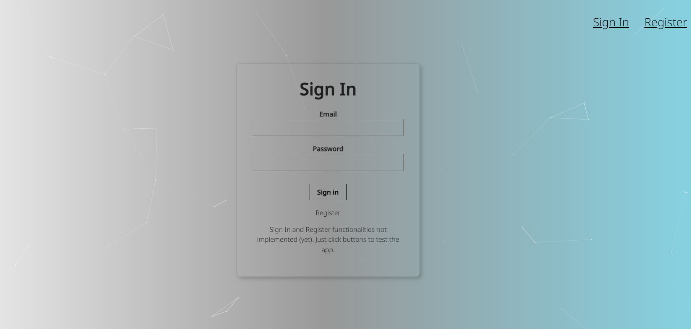
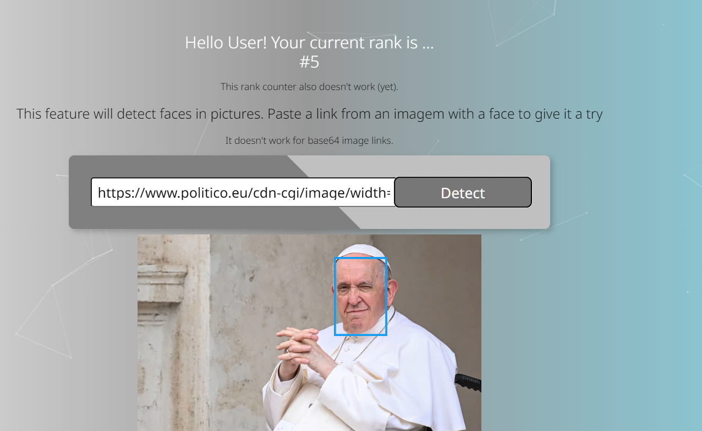

# ZTM Academy - Face Recognition App

This app is part of the course at [The Complete Web Developer in 2022](https://zerotomastery.io/courses/coding-bootcamp/). The course goes through HTML, CSS, JavaScript, Node.js, Machine Learning, and much more.

## Table of contents

- [ZTM Academy - Face Recognition App](#ztm-academy---face-recognition-app)
  - [Table of contents](#table-of-contents)
  - [Overview](#overview)
    - [The app](#the-app)
    - [Screenshot](#screenshot)
    - [Links](#links)
  - [My process](#my-process)
    - [Built with](#built-with)
    - [What I learned x Continued Development](#what-i-learned-x-continued-development)
    - [Useful resources](#useful-resources)
  - [Author](#author)

## Overview

### The app

Users should be able to:

- Navigate throught Sign In, Register, Sign Out (the funcions are not implemented yet, although the buttons are working)
- Paste a link for a picture with a face, and the app will highlight where the face is.

### Screenshot

### Links

- Solution URL (work in progress): [Face Recognition App](https://francomoraes.github.io/face-recognition-app/)

## My process

### Built with

- Semantic HTML5 markup
- CSS custom properties
- Flexbox
- [React](https://reactjs.org/) - JS library
- [Clarifai](https://www.clarifai.com/) - A.I. library
- [Particles-js](https://www.npmjs.com/package/react-particles-js) - Styles library
- [React-tilt](https://www.npmjs.com/package/react-tilt) - Styles library
- [Tachyons](https://tachyons.io/) - CSS Tollkit - Open source component library

### What I learned x Continued Development

The projetct was perfect to learn that there are tremendous amounts of code already set and ready for us to catch, customize and use in our own projects. The Tachyons library, for example, makes it very fast and simple to implement styles in any project; the tilt and particles libraries really make an impression with very little effort; and the Clarifai API that gives us the opportunity to play with A.I. and add it to our projects. Reallt fantastic.

Next steps:
- Add login/register features
- Add backend connections
- Add recognition to more than one face at the same image

### Useful resources

- [CSS Flexbox](https://css-tricks.com/snippets/css/a-guide-to-flexbox/) - A guide to flexbox is a constant visit. There's always something to improve on this matter.
- [Clarifai](https://www.clarifai.com/) - A.I. library
- [Particles-js](https://www.npmjs.com/package/react-particles-js) - Styles library
- [React-tilt](https://www.npmjs.com/package/react-tilt) - Styles library
- [Tachyons](https://tachyons.io/) - CSS Tollkit - Open source component library
- [Zero to Maestry Github](https://github.com/zero-to-mastery)

## Author

Franco Moraes  
 [GitHub](https://github.com/francomoraes)  
 [LinkedIn](https://www.linkedin.com/in/francomoraes/)